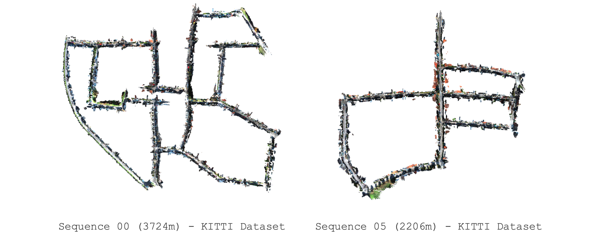
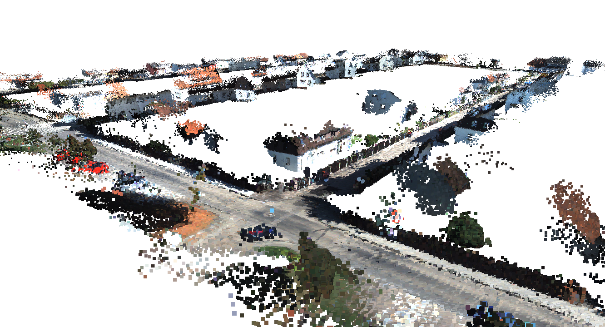

<p align="center">
<p align="center">
<h1 align="center">VGGT-Long: Chunk it, Loop it, Align it – Pushing VGGT’s Limits on Long RGB Sequences</h1>
</p>





### **Change Log**

`[14 Jun 2025]` GitHub code release.

##  Setup, Installation & Running

### 🖥️ 1 - Hardware and System Environment 

This project was developed, tested, and run in the following hardware/system environment

```
Hardware Environment：
    CPU(s): Intel Xeon(R) Gold 6128 CPU @ 3.40GHz × 12
    GPU(s): NVIDIA RTX 4090 (24 GiB VRAM)
    RAM: 67.0 GiB (DDR4, 2666 MT/s)
    Disk: Dell 8TB 7200RPM HDD (SATA, Seq. Read 220 MiB/s)

System Environment：
    Linux System: Ubuntu 22.04.3 LTS
    CUDA Version: 11.8
    cuDNN Version: 9.1.0
    NVIDIA Drivers: 555.42.06
    Conda version: 23.9.0 (Miniconda)
```

### 📦 2 - Environment Setup 

> **Note:** This repository contains a significant amount of `C++` code, but our goal is to make it as out-of-the-box usable as possible for researchers, as many deep learning researchers may not be familiar with `C++` compilation. Currently, the code for `VGGT-Long` can run in a **pure `Python` environment**, which means you can skip all the `C++` compilation steps in the `README`.

#### Step 1: Dependency Installation

Creating a virtual environment using conda (or miniconda),

```cmd
conda create -n vggt-long python=3.10
conda activate vggt-long
# pip version created by conda: 25.1
```

Next, install `PyTorch`,

```cmd
pip install torch==2.2.0 torchvision==0.17.0 torchaudio==2.2.0 --index-url https://download.pytorch.org/whl/cu118
# Verified to work with CUDA 11.8 and torch 2.2.0
```

Install other requirements,

```cmd
pip install -r requirements.txt
```

#### Step 2: Weights Download

Download all the pre-trained weights needed:

```cmd
bash ./scripts/download_weights.sh
```

You can skip the next two steps if you would like to run `VGGT-Long` in pure `Python`.

#### Step 3 (Optional) : Compile Loop-Closure Correction Module

We provide a Python-based Sim3 solver, so `VGGT-Long` can run the loop closure correction solving without compiling `C++` code. However, we still recommend installing the `C++` solver as it is more **stable and faster**.

```cmd
python setup.py install
```


#### Step 4 (Optional) : Compile `DBoW` Loop-Closure Detection Module


Install the `OpenCV C++ API`.

```cmd
sudo apt-get install -y libopencv-dev
```

Install `DBoW2`

```cmd
cd DBoW2
mkdir -p build && cd build
cmake ..
make
sudo make install
cd ../..
```

Install the image retrieval

```cmd
pip install ./DPRetrieval
```


### 🚀 3 - Running the code 


```cmd
python vggt_long.py --image_dir ./path/to/your/image_sequence
```

## Acknowledgements

Our project is based on [VGGT](https://github.com/facebookresearch/vggt), [DPV-SLAM](https://github.com/princeton-vl/DPVO), [GigaSLAM](https://github.com/DengKaiCQ/GigaSLAM). Our work would not have been possible without these excellent repositories.
