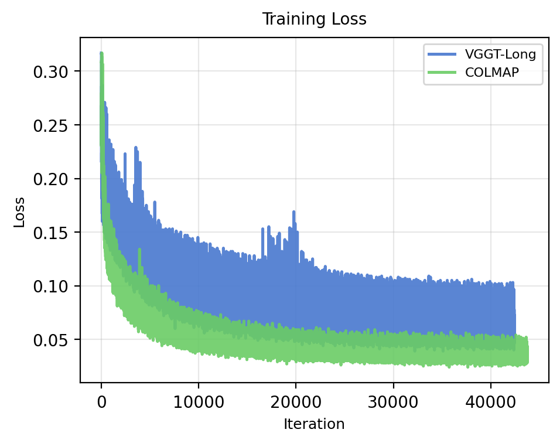

# 🎯 Gaussian Splatting from VGGT on Large Number of Frames


This repository implements a **VGGT-Long → Gaussian Splatting** pipeline, combining and modifying code from the following repositories:

- [VGGT-Long](https://github.com/DengKaiCQ/VGGT-Long)
- [VGGT](https://github.com/facebookresearch/vggt)

Based on the papers:

- [VGGT-Long: *Chunk it, Loop it, Align it — Pushing VGGT's Limits on Kilometer-scale Long RGB Sequences*](https://arxiv.org/abs/2507.16443)
- [VGGSfM: *Visual Geometry Grounded Deep Structure from Motion*](https://arxiv.org/abs/2312.04563)

For Gaussian Splatting, this project uses code from:

- [gsplat](https://github.com/nerfstudio-project/gsplat)

---

## 📊 Comparison: COLMAP vs VGGT-Long based Gaussian Splatting

Datasets [Mip-NeRF 360](https://jonbarron.info/mipnerf360/)  and [Tanks and Temples](https://www.tanksandtemples.org/)
### Full Frame Example

| COLMAP | VGGT-Long |
|:------:|:----------:|
|  |  |

### Cropped Region

| COLMAP | VGGT-Long |
|:------:|:----------:|
|  |  |

**More examples:** [Open examples page](docs/examples.md)

---


### 📉 Training Loss

<p align="center">
  
</p>

---


### Metrics and computation time

| **Pipeline** | **Scene** | **Time (s)** | **GS Start** | **GS Result** | **PSNR**   | **SSIM**   | **LPIPS** |
| ------------ | --------- | ------------ | ------------ | ------------- | ---------- | ---------- | --------- |
| COLMAP       | bonsai    | 1184         | 261,255      | 2,197,821     | **30.891** | **0.9387** | **0.142** |
| VGGT-LONG    | bonsai    | 2069         | 108,500      | 2,017,883     | 29.419     | 0.9009     | 0.179     |
| COLMAP       | kitchen   | 1741         | 290,444      | 1,860,121     | **31.463** | **0.9323** | **0.097** |
| VGGT-LONG    | kitchen   | 1437         | 46,788       | 1,890,648     | 24.967     | 0.7852     | 0.212     |
| COLMAP       | ignatius  | 731          | 209,541      | 4,366,405     | **20.477** | **0.7050** | **0.241** |
| VGGT-LONG    | ignatius  | 898          | 51,193       | 3,193,499     | 18.263     | 0.4959     | 0.448     |
| COLMAP       | garden    | 500          | 207,923      | 6,388,310     | **27.537** | **0.8606** | **0.098** |
| VGGT-LONG    | garden    | 695          | 43,006       | 5,436,518     | 24.103     | 0.7092     | 0.208     |


Table  presents a comparison between the COLMAP and VGGT-LONG reconstruction pipelines across several scenes from 
usual NeRF 360 benchmarks + Ignatius scene from https://www.tanksandtemples.org/
Each experiment reports the total computation time to produce sparse model, the initial and resulting number of Gaussian splats (GS), and three common image quality metrics — PSNR, SSIM, and LPIPS.

Overall, COLMAP generally produces higher reconstruction quality, indicated by higher PSNR and SSIM values and lower LPIPS, particularly for the bonsai and kitchen scenes.
However, VGGT-LONG tends to generate reconstructions starting from a smaller Gaussian set and sometimes results in a denser splat distribution, suggesting a different optimization and density allocation strategy.

Execution times vary across scenes: in some cases, VGGT-LONG takes longer despite lower perceptual fidelity, illustrating inherent trade-offs between computational efficiency and reconstruction accuracy across the two methods.

## ⚙️ Setup, Installation & Running

### 🖥️ 1. Hardware and System Environment

*(Describe GPU/OS/requirements here, e.g. CUDA version, Python environment, etc.)*

### 🖥️ 1. Hardware and System Environment

This project was developed, tested, and run in the following hardware/system environment:

```
Hardware Environment (similar to VGGT-Long paper):

    CPU(s)        13th Gen Intel® Core™ i7-13700K x 24 
    GPU           NVIDIA GeForce RTX 4090 — 24 GB VRAM
    RAM           125 GB total
    Disk(s)       3.6 TB HDD, 1.8 TB NVMe SSD 

System Environment:
    OS            Ubuntu 22.04.5 LTS
    CUDA Toolkit  ❌ not installed 
    NVIDIA Driver 550.144.03
    Conda         version: conda 25.3.1
```

### 📦 2. Environment Setup 

#### Step 1: Dependency Installation

We use three virtual environments:
- `vggsfm_tmp`: Requirements from VGGT-Long repository
- `colmap_env`: Requirements from VGGT repository  
- `py11`: gsplat dependencies

Create these conda environments and install dependencies using the corresponding `requirements.txt` files.

**TODO:** Check how to merge virtual environments into one

#### Step 2: COLMAP Installation

Install COLMAP for bundle adjustment and image undistortion using conda (recommended):

```bash
# Activate the colmap_env environment
conda activate colmap_env

# Install COLMAP from conda-forge
conda install -c conda-forge colmap
```

**Alternative system-wide installation:**
- **macOS:** `brew install colmap`
- **Windows or manual installation:** Follow the official [COLMAP installation guide](https://colmap.github.io/install.html)

#### Step 3: Weights Download

Download all the pre-trained weights needed:

```cmd
bash ./scripts/download_weights.sh
```

### 🔧 Pipeline Structure 

1. **Predict camera poses, intrinsics and depth maps** using VGGT-Long model 

2. **Export to COLMAP** using functionality provided by VGGT:

```bash 
# With bundle adjustment
python demo_colmap.py --scene_dir=/YOUR/SCENE_DIR/ --use_ba --max_query_pts=1024 --query_frame_num=6
```

Images should be in `/YOUR/SCENE_DIR/images/`. This folder should contain only the images. 
The reconstruction result (camera parameters and 3D points) will be automatically saved under `/YOUR/SCENE_DIR/sparse/` in the COLMAP format, such as:

``` 
SCENE_DIR/
├── images/
└── sparse/
    ├── cameras.bin
    ├── images.bin
    └── points3D.bin
```

The main modification is in `vggt/dependency/track_predict.py` where the query frames are changed from DINO-ranked ones to sampling with regular intervals: 
```
# Original: Find query frames
# query_frame_indexes = generate_rank_by_dino(images, query_frame_num=query_frame_num, device=device)

# New: Sample every 3rd frame
query_frame_indexes = list(range(0, len(images), 3))
```


Additionally, batched processing has been added to save memory for long sequences (200+ images):

- **Feature extraction batching** in `vggt/dependency/track_predict.py`: Processes images in batches of 50 to avoid CUDA out-of-memory errors
- **Correlation block chunking** in `vggt/dependency/track_modules/base_track_predictor.py`: Processes correlation computation in chunks of 50 frames
- **Memory management**: Automatic GPU cache clearing between batches to optimize memory usage

These modifications enable processing of long image sequences (e.g., 292 images) that would otherwise exceed GPU memory limits.


3. **Undistort images** using pinhole camera model:
```bash 
colmap image_undistorter \
    --image_path "$IMAGE_DIR" \
    --input_path "$IMAGE_DIR/sparse" \
    --output_path "$UNDISTORTED_COLMAP_OUTPUT" \
    --output_type COLMAP \
    --max_image_size 2000
```
4. **Gaussian Splatting**

The exported COLMAP files can be directly used with [gsplat](https://github.com/nerfstudio-project/gsplat) for Gaussian Splatting training. Install `gsplat` following their official instructions (we recommend `gsplat==1.3.0`).

An example command to train the model is:
```bash
cd "$WORKDIR/../gsplat/examples"
mkdir -p "$WORKDIR/../gsplat/examples/results/$GSPLAT_OUTPUT_DIR"


CUDA_VISIBLE_DEVICES=0 python simple_trainer.py default \
    --data_dir "${REMOTE_IMAGE_DIR}_undistorted" \
    --data_factor 1 \
    --result_dir "$WORKDIR/../gsplat/examples/results/$GSPLAT_OUTPUT_DIR" \
    --save_ply \
    --ply_steps 30000 \
    --disable_viewer \
    --render_traj_path "ellipse"
```


### 🚀 Running Pipelines 

The simplest way to run the pipeline is on a remote machine through SSH connection using the scripts:

**Run the pipeline to get sparse model from VGGT-Long:**
```bash
./src_vggt_colmap/run_pipeline_vggt_long_colmap.sh
```

**Run the pipeline to get sparse model from COLMAP:**
```bash
./src_vggt_colmap/run_pipeline_vggt_long_colmap.sh
```

**Download results:**
```bash
./src_vggt_colmap/download_results_vggt_colmap.sh
./src_vggt_colmap/download_results_colmap.sh
```

**Parsing log files to collect metrics:**
```bash
./src_metrics/collect_metrics.sh
```

## 📄 License

This codebase follows VGGT's license. Please refer to `./LICENSE.txt` for applicable terms.

For commercial use, please follow the link to [VGGT](https://github.com/facebookresearch/vggt) and utilize the commercial version of the pre-trained weights: [VGGT-1B-Commercial](https://huggingface.co/facebook/VGGT-1B-Commercial).

## 📖 References

If you use this code, please cite the original papers:

```bibtex
@article{wang2024vggt-long,
  title={VGGT-Long: Chunk it, Loop it, Align it -- Pushing VGGT's Limits on Kilometer-scale Long RGB Sequences},
  author={Wang, Ziyuan and others},
  journal={arXiv preprint arXiv:2507.16443},
  year={2024}
}

@article{wang2023vggsfm,
  title={VGGSfM: Visual Geometry Grounded Deep Structure from Motion},
  author={Wang, Jianyuan and Karaev, Nikita and Rupprecht, Christian and Novotny, David},
  journal={arXiv preprint arXiv:2312.04563},
  year={2023}
}
```

## 🔬 More Experiments

[Content for additional experiments and results would go here]
