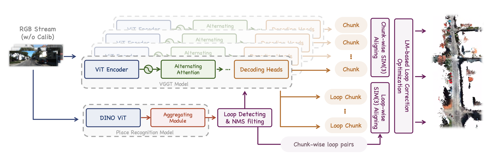
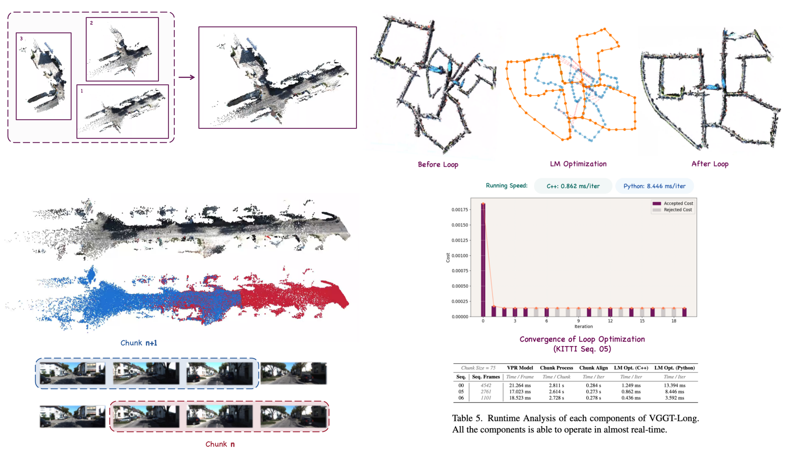
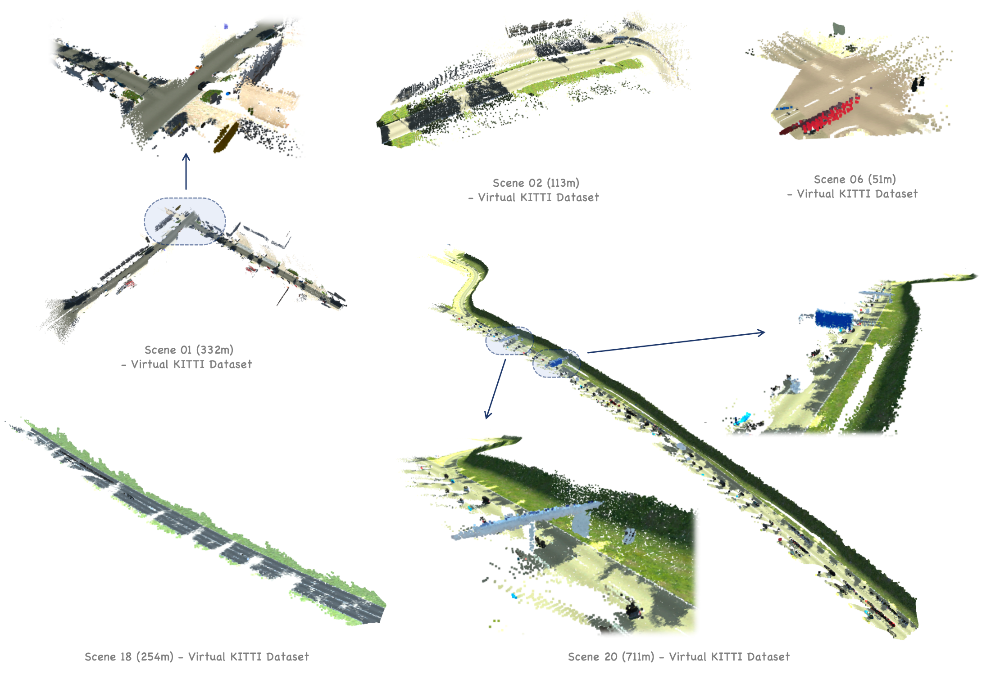
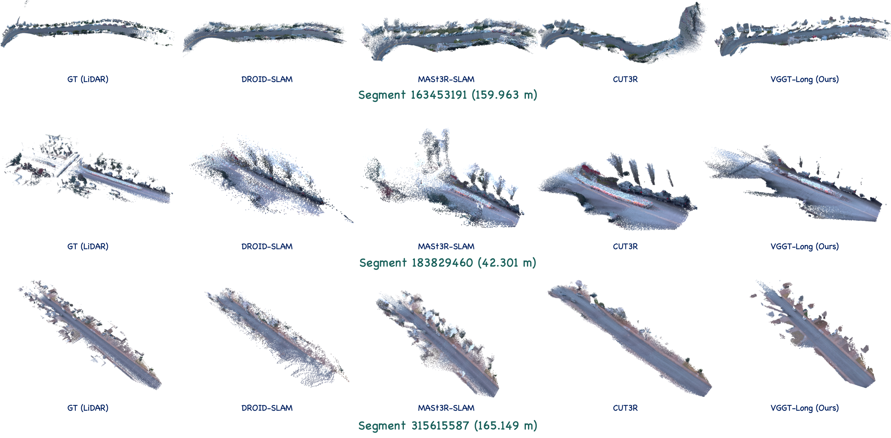
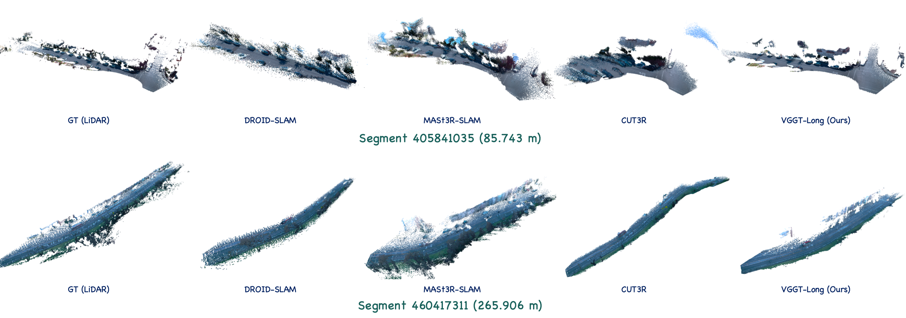
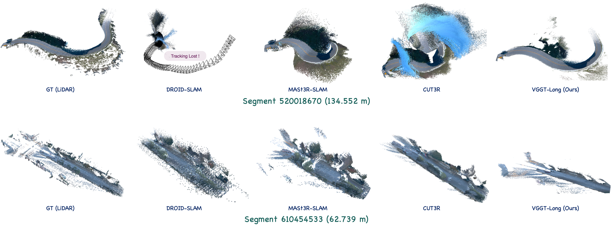

<p align="center">
<p align="center">
<h1 align="center">VGGT-Long: Chunk it, Loop it, Align it -- Pushing VGGT's Limits on Kilometer-scale Long RGB Sequences</h1>
</p>

This repository contains the source code for our work:

[VGGT-Long: Chunk it, Loop it, Align it -- Pushing VGGT's Limits on Kilometer-scale Long RGB Sequences](https://arxiv.org/abs/2507.16443)

**Abstrat:** Foundation models for 3D vision have recently demonstrated remarkable capabilities in 3D perception. However, extending these models to large-scale RGB stream 3D reconstruction remains challenging due to memory limitations. In this work, we propose **VGGT-Long**, a simple yet effective system that pushes the limits of monocular 3D reconstruction to **kilometer-scale, unbounded outdoor environments**. Our approach addresses the scalability bottlenecks of existing models through a chunk-based processing strategy combined with overlapping alignment and lightweight loop closure optimization. Without requiring camera calibration, depth supervision or model retraining, VGGT-Long achieves trajectory and reconstruction performance comparable to traditional methods. We evaluate our method on KITTI, Waymo, and Virtual KITTI datasets. VGGT-Long not only runs successfully on long RGB sequences where foundation models typically fail, but also produces accurate and consistent geometry across various conditions. Our results highlight the potential of leveraging foundation models for scalable monocular 3D scene in real-world settings, especially for autonomous driving scenarios.





### **Changelog**

`[02 Aug 2025]` Updated the licensing terms of `VGGT-Long` to reflect the upstream dependency license (See [VGGT](https://github.com/facebookresearch/vggt) for the changes). Please see the [License Section](#license) for full details.

`[30 Jul 2025]` Chunk Align speed up (`0.273 s/iter`$\rightarrow$`0.175 s/iter` on my machine).

`[23 Jul 2025]` Fixed some bugs in `scripts/download_weights.sh`.

`[22 Jul 2025]` Arxiv submitted.

`[15 Jul 2025]` To help you better understand our project, we have updated some visualizations.

`[14 Jun 2025]` GitHub code release.

##  Setup, Installation & Running

### 🖥️ 1 - Hardware and System Environment 

This project was developed, tested, and run in the following hardware/system environment

```
Hardware Environment：
    CPU(s): Intel Xeon(R) Gold 6128 CPU @ 3.40GHz × 12
    GPU(s): NVIDIA RTX 4090 (24 GiB VRAM)
    RAM: 67.0 GiB (DDR4, 2666 MT/s)
    Disk: Dell 8TB 7200RPM HDD (SATA, Seq. Read 220 MiB/s)

System Environment：
    Linux System: Ubuntu 22.04.3 LTS
    CUDA Version: 11.8
    cuDNN Version: 9.1.0
    NVIDIA Drivers: 555.42.06
    Conda version: 23.9.0 (Miniconda)
```

### 📦 2 - Environment Setup 

**Note:** This repository contains a significant amount of `C++` code, but our goal is to make it as out-of-the-box usable as possible for researchers, as many deep learning researchers may not be familiar with `C++` compilation. Currently, the code for `VGGT-Long` can run in a **pure Python environment**, which means you can skip all the `C++` compilation steps in the `README`.

#### Step 1: Dependency Installation

Creating a virtual environment using conda (or miniconda),

```cmd
conda create -n vggt-long python=3.10
conda activate vggt-long
# pip version created by conda: 25.1
```

Next, install `PyTorch`,

```cmd
pip install torch==2.2.0 torchvision==0.17.0 torchaudio==2.2.0 --index-url https://download.pytorch.org/whl/cu118
# Verified to work with CUDA 11.8 and torch 2.2.0
```

Install other requirements,

```cmd
pip install -r requirements.txt
```

#### Step 2: Weights Download

Download all the pre-trained weights needed:

```cmd
bash ./scripts/download_weights.sh
```

You can skip the next two steps if you would like to run `VGGT-Long` in pure `Python`.

#### Step 3 (Optional) : Compile Loop-Closure Correction Module

We provide a Python-based Sim3 solver, so `VGGT-Long` can run the loop closure correction solving without compiling `C++` code. However, we still recommend installing the `C++` solver as it is more **stable and faster**.

```cmd
python setup.py install
```

#### Step 4 (Optional) : Compile `DBoW` Loop-Closure Detection Module

The VPR Model of `DBoW` is for performing VPR Model inference with CPU-only. You can skip this step.

<details>
  <summary><strong>See details</a></strong></summary>

Install the `OpenCV C++ API`.


```cmd
sudo apt-get install -y libopencv-dev
```

Install `DBoW2`

```cmd
cd DBoW2
mkdir -p build && cd build
cmake ..
make
sudo make install
cd ../..
```

Install the image retrieval

```cmd
pip install ./DPRetrieval
```

</details>

### 🚀 3 - Running the code


```cmd
python vggt_long.py --image_dir ./path_of_images
```

You can modify the parameters in the `configs/base_config.yaml` file. If you have created multiple yaml files to explore the effects of different parameters, you can specify the file path by adding `--config` to the command. For example:

```cmd
python vggt_long.py --image_dir ./path_of_images --config ./configs/base_config.yaml
```

### 🚨 4 - **Important Notice**: Memory Management & Requirements

In long-sequence scenarios, addressing CPU memory and GPU memory limitations has always been a core challenge. VGGT-Long resolves **GPU** memory limitations encountered by VGGT through chunk-based input partitioning. As for **CPU** memory constraints, we achieve lower CPU memory usage by storing intermediate results on the **disk** (the consequences of CPU memory overflow are far more severe than GPU issues - while GPU OOM may simply terminate the program, **CPU OOM can cause complete system freeze**, which we absolutely want to avoid). VGGT-Long automatically retrieves locally stored intermediate results when needed. Upon completion, these temporary files are **automatically deleted** to prevent excessive disk space consumption. This implementation implies two key considerations:

1. Before running, **sufficient disk space** must be reserved (approximately 50GiB for 4500-frame KITTI 00 sequences, or ~5GiB for 300-frame short sequences);

2. The actual runtime depends on your **disk I/O speed** and **memory-disk bandwidth**, which may vary significantly across different computer systems.

## Datasets

Our test datasets are all sourced from publicly available autonomous driving datasets, and you can download them according to the official instructions.

**Waymo Open Dataset**: [Main page](https://waymo.com/open/), [V1.4.1](https://console.cloud.google.com/storage/browser/waymo_open_dataset_v_1_4_1)

**Virtual KITTI Dataset** (V1.3.1): [Link](https://europe.naverlabs.com/research/computer-vision/proxy-virtual-worlds-vkitti-1/)

**KITTI Dataset Odometry Track**: [Link](https://www.cvlibs.net/datasets/kitti/eval_odometry.php)

## Acknowledgements

Our project is based on [VGGT](https://github.com/facebookresearch/vggt), [DPV-SLAM](https://github.com/princeton-vl/DPVO), [GigaSLAM](https://github.com/DengKaiCQ/GigaSLAM). Our work would not have been possible without these excellent repositories.

## Citation

If you find our work helpful, please consider citing:

```
@article{deng2025vggtlong,
      title={VGGT-Long: Chunk it, Loop it, Align it -- Pushing VGGT's Limits on Kilometer-scale Long RGB Sequences}, 
      author={Kai Deng and Zexin Ti and Jiawei Xu and Jian Yang and Jin Xie},
      journal={arXiv preprint arXiv:2507.16443},
      year={2025}
}
```

## License

The `VGGT-Long` codebase follows `VGGT`'s license, please refer to `./LICENSE.txt` for applicable terms. For commercial use, please follow the link [VGGT](https://github.com/facebookresearch/vggt) that should utilize the commercial version of the pre-trained weight. [Link of VGGT-1B-Commercial](https://huggingface.co/facebook/VGGT-1B-Commercial)

## More Experiments





