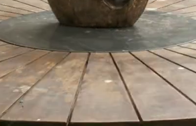
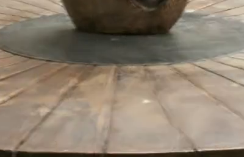

# Examples and Visual Results

This page shows side-by-side comparisons used in the README. Image paths are relative to this file (use `../assets/...`).

## Full frame example

| COLMAP | VGGT‑Long |
|:------:|:---------:|
|  |  |

## Cropped region

| COLMAP (crop) | VGGT‑Long (crop) |
|:-------------:|:----------------:|
|  |  |

## Notes
- If images do not display, check paths and commit `assets/gs_images/...` into the repo.
- For smaller file sizes, include web-optimized thumbnails (e.g. `assets/preview/...`) and reference them here.
- To add more comparisons, copy the table rows above and update the image paths.
```// filepath: c:\Users\mikes\Documents\GaussianSplatting\VGGT-Long-Gsplat\docs\examples.md
# Examples and Visual Results

This page shows side-by-side comparisons used in the README. Image paths are relative to this file (use `../assets/...`).

## Full frame example

| COLMAP | VGGT‑Long |
|:------:|:---------:|
|  |  |

## Cropped region

| COLMAP (crop) | VGGT‑Long (crop) |
|:-------------:|:----------------:|
|  |  |

## Notes
- If images do not display, check paths and commit `assets/gs_images/...` into the repo.
- For smaller file sizes, include web-optimized thumbnails (e.g. `assets/preview/...`) and reference them here.
- To add more comparisons, copy the table rows above and update the image paths.